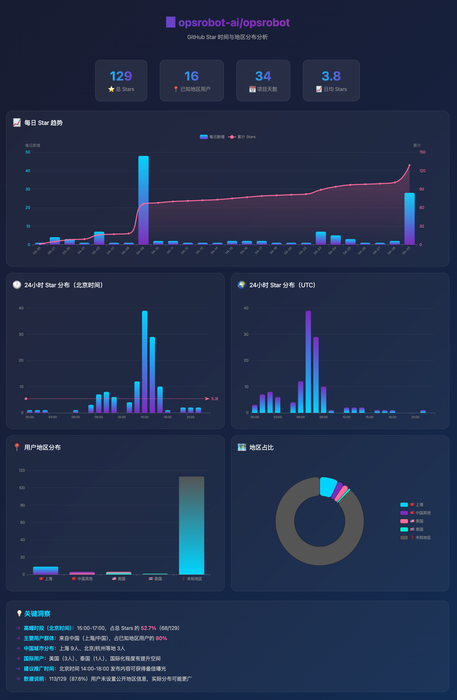

# GitHub Star Analyzer

分析 GitHub 仓库的 Star 时间分布和地区分布，生成可视化 HTML 报告。

## 功能

- 📊 **每日 Star 趋势**：柱状图 + 累计折线图
- 🕐 **24小时分布**：展示 Star 在一天中的时间分布（北京时间）
- 🌍 **地区分布**：饼图展示用户地理分布

## 本地运行

```bash
# 安装依赖
pip install -r requirements.txt

# 运行分析
python github_star_analyzer.py owner/repo

# 指定输出路径
python github_star_analyzer.py owner/repo -o report.html

# 使用 GitHub Token（推荐，避免 API 限制）
python github_star_analyzer.py owner/repo --token ghp_xxxx
# 或设置环境变量
export GITHUB_TOKEN=ghp_xxxx
python github_star_analyzer.py owner/repo
```

## Docker 运行

### 构建镜像

```bash
cd github-star-analyzer
docker build -t github-star-analyzer .
```

### 运行容器

```bash
# 基本用法
docker run --rm -v $(pwd)/output:/output github-star-analyzer owner/repo -o /output/report.html

# 使用 GitHub Token
docker run --rm -v $(pwd)/output:/output -e GITHUB_TOKEN=ghp_xxxx github-star-analyzer owner/repo -o /output/report.html
```

### 使用 docker-compose

```yaml
version: '3.8'
services:
  analyzer:
    image: github-star-analyzer
    volumes:
      - ./output:/output
    environment:
      - GITHUB_TOKEN=ghp_xxxx
    command: ["owner/repo", "-o", "/output/report.html"]
```

## 输出示例



生成的 HTML 报告包含：

1. **统计卡片**：总 Stars、活跃天数、单日最高
2. **每日趋势图**：双 Y 轴，柱状图显示每日新增，折线图显示累计
3. **24小时分布图**：展示 Star 在一天中的时间分布
4. **地区分布图**：饼图展示用户地理分布

## 参数说明

| 参数 | 说明 | 默认值 |
|------|------|--------|
| `repo` | 仓库名称（格式: owner/repo） | 必填 |
| `--token` | GitHub Personal Access Token | 从环境变量 `GITHUB_TOKEN` 读取 |
| `--output, -o` | 输出文件路径 | `star-analysis.html` |

## GitHub Token

不使用 Token 也可以运行，但 GitHub API 有速率限制（60次/小时）。

推荐创建 Personal Access Token：
1. 访问 https://github.com/settings/tokens
2. 创建 token，勾选 `public_repo` 权限即可
3. 通过 `--token` 参数或 `GITHUB_TOKEN` 环境变量传入

## 示例

```bash
# 分析 opsrobot-ai/opsrobot 仓库
python github_star_analyzer.py opsrobot-ai/opsrobot -o opsrobot-stars.html

# Docker 方式
docker run --rm -v $(pwd):/output github-star-analyzer opsrobot-ai/opsrobot -o /output/opsrobot-stars.html
```

## License

MIT
